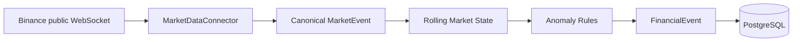

# FinStream

**FinStream is an open-source real-time financial event and context engine for AI agents.** It senses unusual market behavior and records it as structured `FinancialEvent` data. FinStream is **not a trading bot**, does **not execute trades**, and does **not provide investment advice**.



## V0.1 capabilities

- Streams public aggregate trades for `BTCUSDT`, `ETHUSDT`, and `SOLUSDT`; no API key is required.
- Normalizes provider JSON immediately, maintains bounded 30-minute in-memory windows, and detects rapid drops, rapid pumps, and abnormal volume.
- Applies configurable per-symbol/per-event cooldown and persists only anomalies (not raw ticks) to PostgreSQL JSONB.
- Reconnects with exponential backoff, ignores malformed messages, and exposes `/actuator/health`.

## Run locally

Requirements: Java 21, Maven 3.9+, and Docker Compose.

```bash
docker compose up -d postgres
mvn spring-boot:run
```

The WebSocket is deliberately off by default. Enable real public data with:

```bash
BINANCE_ENABLED=true mvn spring-boot:run
```

Edit `src/main/resources/application.yml` to lower `threshold-percent` or the volume `ratio` for development. Environment variables `DB_URL`, `DB_USER`, and `DB_PASSWORD` configure PostgreSQL. Inspect events with:

```bash
docker compose exec postgres psql -U finstream -d finstream \
  -c "select event_time,symbol,event_type,severity,anomaly_score,metrics from financial_event order by event_time desc;"
```

Run the network-independent test suite with `mvn test`. See [architecture](docs/architecture.md) and the non-binding [roadmap](docs/roadmap.md).
